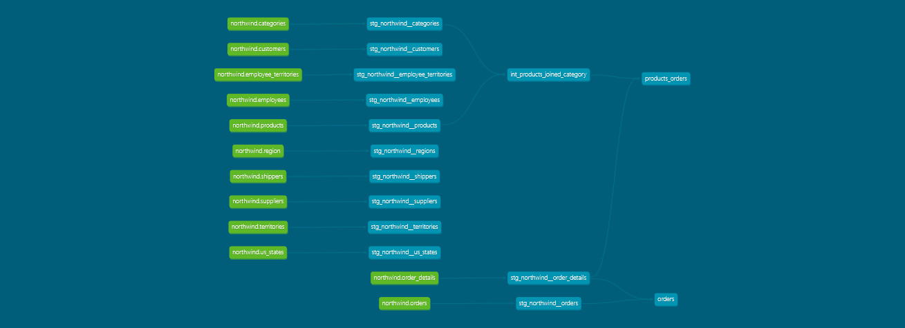

# northwind  
  
Steps with postgres in docker-compose:  
  
```bash
docker-compose build  
docker-compose up -d 
```  
  
For default the postgres create a db called postgres as a maintainance db, but you can ignore it and use the northwind db.  
  
Steps with dbt-core:  

```bash
dbt init
  
#hostname must be localhost 
```
  
host name is 'db' if the postgres database is from the docker-compose.  
  
```bash
cd northwind_dbt  
```
  
```bash
dbt debug  
```

The chart of the lineage created dbt docs automatically when generating dbt docs using the command:  
```bash
dbt docs generate
```
  

  
If you are using harlequin:  
harlequin -a postgres -h localhost -p 5432 -U postgres --password postgres -d northwind  
  
## Proposed Business problems and Marts:  
1. Sales Mart  
  
Tables Involved: orders, order_details, products, customers, employees, shippers  
  
Business Problem:  
  
    Analyze sales performance, revenue generation, and order trends.  
    Understand the effectiveness of sales staff and product popularity.  
    Monitor shipping performance and customer satisfaction.  
  
Key Metrics for the Dashboard:  
  
    Total sales revenue.  
    Number of orders per customer, region, or employee.  
    Average order value.  
    Product sales volume.  
    Shipping times and delays (based on order_date, shipped_date, required_date).  
  
Intermediate Layer (Preparation):  
  
    Join orders, order_details, products, customers, and employees.  
    Calculate total order value per order (unit_price * quantity * (1 - discount)).  
    Standardize date formats and handle missing shipped_date values.  
    Transform region names from the customers table.  
    Enrich employee details (join employees for sales performance tracking).  
  
2. Inventory Mart  
  
Tables Involved: products, suppliers, categories  
  
Business Problem:  
  
    Track product stock levels and manage inventory.  
    Monitor supplier performance and product categories.  
    Understand trends in product availability and orders.  
  
Key Metrics for the Dashboard:  
  
    Stock levels (units_in_stock, units_on_order).  
    Reorder trends and low-stock warnings.  
    Supplier performance (based on order frequency, delivery time).  
    Inventory value (unit price * stock levels).  
  
Intermediate Layer (Preparation):  
  
    Join products with suppliers and categories.  
    Transform product categories to more descriptive labels.  
    Calculate inventory value (unit_price * units_in_stock).  
    Flag low-stock items (units_in_stock below reorder_level).  
  
3. Customer Mart  
  
Tables Involved: customers, orders, order_details, region  
  
Business Problem:  
  
    Analyze customer behavior and segment customers by region.  
    Identify top customers by revenue and order frequency.  
    Understand regional sales patterns and customer demographics.  
  
Key Metrics for the Dashboard:  
  
    Customer lifetime value (total orders and revenue per customer).  
    Order frequency per customer.  
    Regional sales distribution.  
    Top customers based on total spending.  
  
Intermediate Layer (Preparation):  
  
    Join customers with orders and order_details.  
    Aggregate customer order values over time.  
    Enrich regional data with region table.  
    Calculate customer lifetime value (sum of orders).  